# ThanksCoffee - Website ☕️
:star: Star Us on Github - it helps!
<div align="center">

<p></p>
<a href="https://github.com/yehezikabeatrix/ThanksCoffee"></a>
<a href="https://github.com/yehezikabeatrix/ThanksCoffee"></a>
<a href="https://github.com/yehezikabeatrix/ThanksCoffee/commits/master"></a>  
<a href="https://www.instagram.com/yehezikabeatrix/"></a> 
<a href="https://www.instagram.com/adekmzrk/"></a> 
<a href="http://badges.mit-license.org"></a> 

</div>

**ThanksCoffee Website** merupakan perpaduan Aplikasi Sistem Kasir (Point of Sales), Manajemen Toko, dan Halaman Pembelian Kopi berbasis website yang digunakan untuk mengelola seluruh proses bisnis pada sebuah toko kopi ThanksCoffee. Aplikasi ini dibuat tanpa mengunakan framework tambahan dan dapat diakses tanpa menggunakan Internet. 

Aplikasi **ThanksCoffee Website** sendiri hadir sebagai langkah efisiensi dalam menangani penjualan produk kopi kepada para pelanggan. Jika dahulu toko-toko cabang hanya menggunakan kalkulator manual atau komputer dengan software yang belum terintegrasi, maka **ThanksCoffee Website** hadir sebagai inovator untuk menjawab pertumbuhan toko-toko cabang yang terus bertambah.

#### ⚡️ Kelebihan dari aplikasi ini adalah :
 - Pemuja UI UX 
 - Dibangun menggunakan `HTML dan CSS`
 - Animasi menggunakan `CSS dan JS`
 - Database menggunakan `MySQL`
 - Terdapat fitur `Pembersihan Database Otomatis`
 - Mudah untuk dimodifikasi
 - Website Dinamis
 - Dapat diakses tanpa menggunakan internet

#### ⚡️ Role yang terdapat di aplikasi ini adalah : 
 - Manajer  
 - Karyawan
 - Pelanggan

#### ⚡️ Manfaat yang didapatkan dari aplikasi ini :
 - Antara kasir dan pelanggan tidak perlu bertatap muka untuk memesan produk
 - Pelanggan dapat melihat-lihat produk dengan lebih leluasa, karena memiliki layar sendiri di mejanya
 - Meningkatkan level toko kopi *to the next level*
 - Mengurangi beban manajer untuk memonitoring toko kopi
 - Menambah keunikan toko kopi
 - Menarik pelanggan yang *instagrammable* dan haus modernisasi
 - Efisiensi proses bisnis

## Requirements 🔧
Tentu saja diperlukan peralatan untuk setiap perang. Maka, siapkan beberapa aplikasi berikut untuk menjalankan **ThanksCoffee Website** dengan sukses :
 - XAMPP (versi 3.3.0 atau versi terbaru).
 - PHP versi 5.6 atau terbaru
 - Teks Editor (disarankan : Visual Studio Code, Sublime)
 - Web Browser

## Instalasi 🔨
1. Clone atau download source code
    - Pada terminal, clone repo `git clone git@github.com:yehezikabeatrix/ThanksCoffee.git`
    - atau `git clone https://github.com/yehezikabeatrix/ThanksCoffee.git`
    - Jika tidak menggunakan Git, silakan **Download Zip** dan *extract* pada direktori web server (misal: xampp/htdocs)
2. Buat **database baru pada mysql** untuk aplikasi ini dengan nama "thankscoffee"
3. Import database "thankscoffee" menggunakan file `thankscoffee.sql`
4. Pergi ke `db/koneksi.php' lalu edit host, username, dan password sesuai dengan milik kalian, defaultnya seperti ini:
    ```php
    $DATABASE_HOST = 'localhost';
    $DATABASE_USER = 'root';
    $DATABASE_PASS = '';
    ```
5. Selesai    

## Keamanan 🔐
Untuk menjaga sistem, diperluan fitur keamanan agar supaya baik dari pihak manajemen dan pelanggan merasa aman. Beberapa fitur keamanan yang diterapkan di aplikasi ini meliputi:
1. Validasi form input
2. Password handling

## Fitur Yang Dimiliki 🚀
Fitur akan dijelaskan berdasarkan Role yang dimiliki aplikasi ini. Berikut penjelasannya:

### Manajer 👨‍💼
<p></p>

**Manajer** adalah orang dengan jabatan tertinggi dibagian Toko Kopi. Role ini memiliki kelebihan untuk melihat data-data penting toko dan dapat melakukan perubahan juga padanya. Halaman manajer dapat diakses menggunakan URL `localhost:/ThanksCoffee/admin/index.php`

- **Credentials Manajer**
  ```
  Username: manajer
  Password: manajer
  ```  
- **Fitur Yang Dimiliki**
  - Akun Login
    - Login dan Logout
    - Ganti Password 
  - Dashboard
    - Info Pemasukan (Total pemasukan hari ini)
    - Info Product (Jumlah product tersedia dan product kosong)
    - Info Pesanan (Jumlah pesanan selesai dan pesanan baru masuk)
  - Manajemen Pesanan
    - Daftar pesanan masuk hari ini
    - Pembayaran pesanan
    - Penghapusan pesanan
    - Detail pesanan
  - Manajemen Produk
    - Daftar Produk
    - Input Produk Baru
    - Edit Produk (Jumlah stok)
    - Hapus Produk
  - Manajemen Laporan
    - Grafik penjualan produk hari ini
    - Grafik pemasukan perbulan
    - Cetak Penjualan Per Bulan
    - Cetak Penjualan Per Tanggal
  - Manajemen User
    - List User
    - Tambah User Baru
    - Hapus User (jika tidak ada transaksi)
  - Manajemen Toko
    - Edit Nama Cabang
    - Edit Alamat Cabang
    - Edit No telepon Cabang
    - Edit Email Cabang
- **Dokumentasi** <br>
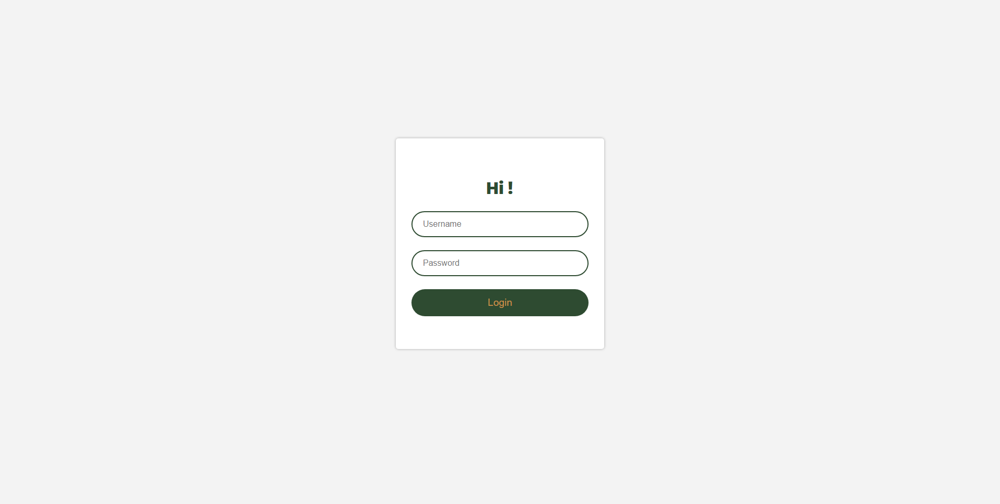</img>
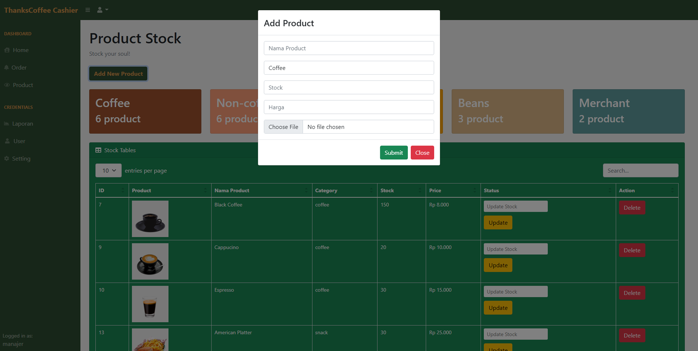</img>
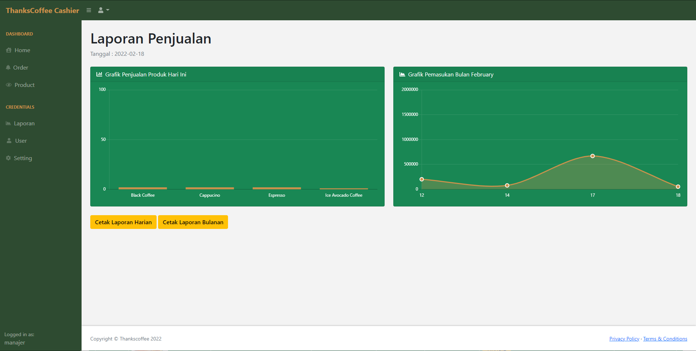</img>
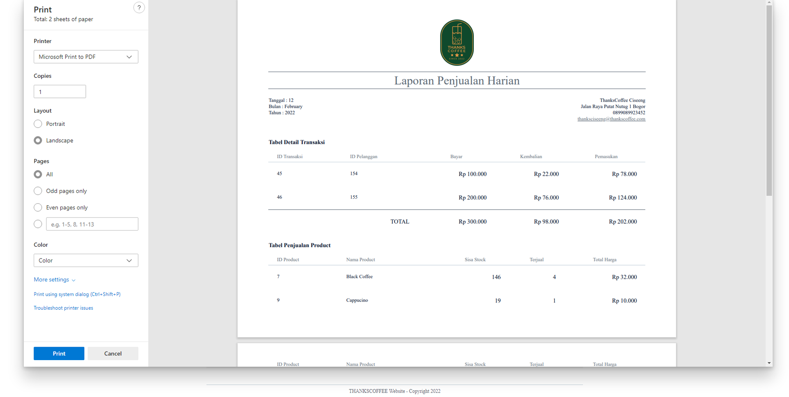</img>
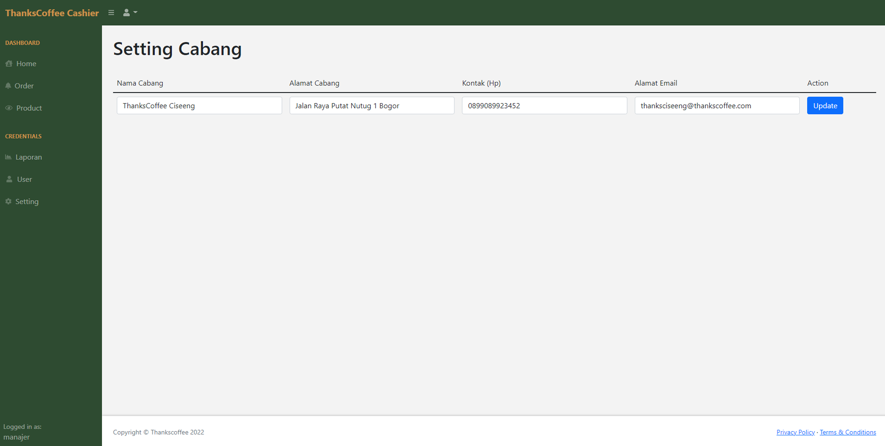</img>
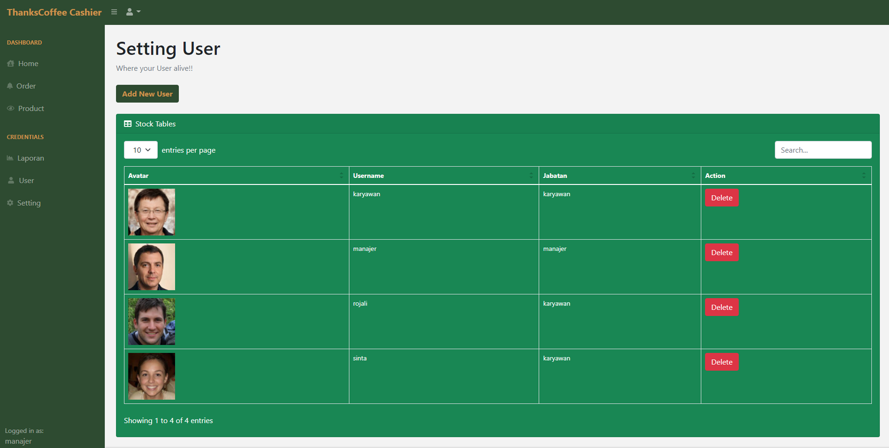</img>


### Karyawan 🤵
<p></p>

**Karyawan** adalah orang yang betugas sebagai kasir dari toko. Tugasnya berhubungan langsung dengan pelanggan dan melayani pesanan mereka. Halaman karyawan dapat diakses menggunakan URL `localhost:/ThanksCoffee/admin/index.php`

- **Credentials Karyawan**
  ```
  Username: karyawan
  Password: karyawan
  ```  
- **Fitur Yang Dimiliki**
  - Akun Login
    - Login dan Logout
    - Ganti Password 
  - Dashboard
    - Info Pemasukan (Total pemasukan hari ini)
    - Info Product (Jumlah product tersedia dan product kosong)
    - Info Pesanan (Jumlah pesanan selesai dan pesanan baru masuk)
  - Manajemen Pesanan
    - Daftar pesanan masuk hari ini
    - Pembayaran pesanan
    - Penghapusan pesanan
    - Detail pesanan
  - Manajemen Produk
    - Daftar Produk
    - Input Produk Baru
    - Edit Produk (Jumlah stok)
    - Hapus Produk
- **Dokumentasi** <br>
</img>
</img>
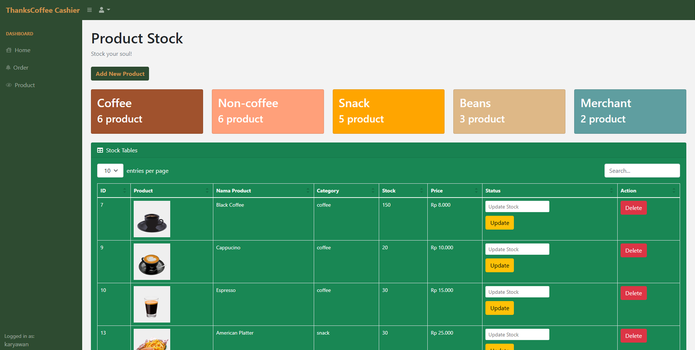</img>
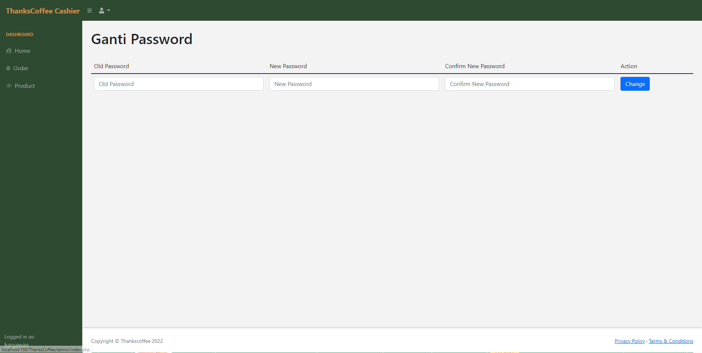</img>
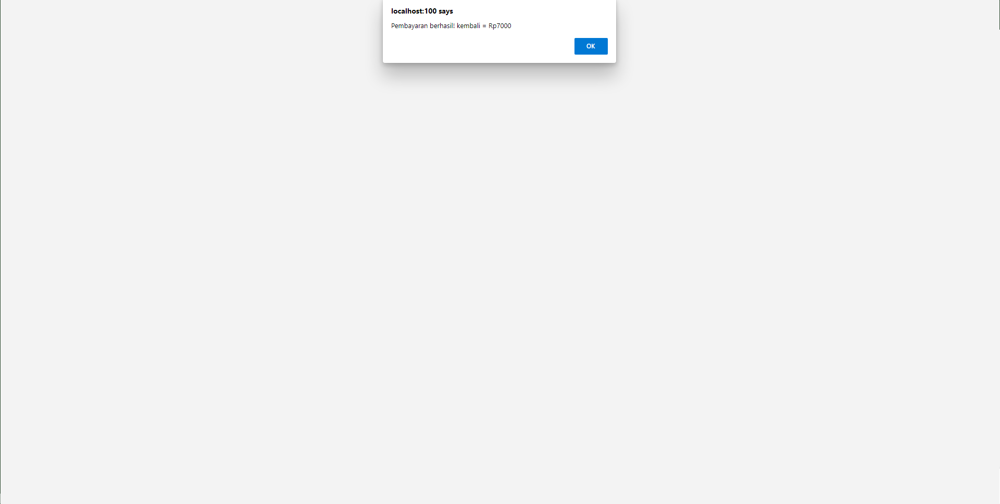</img>
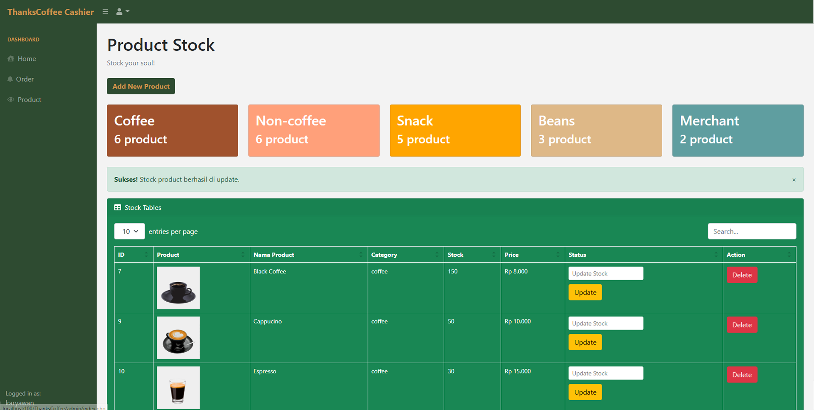</img>


### Pelanggan 👨‍🎓
<p></p>

**Pelanggan** adalah orang yang membeli produk di toko. Setiap pelanggan mendapatkan laptop atau PC masing-masing untuk memesan pesanannya. Halaman pelanggan dapat diakses menggunakan URL `localhost:/ThanksCoffee/index.php`

- **Fitur Yang Dimiliki**
  - Login
    - Login dengan username dan Logout
    - Username tidak boleh sama di hari yang sama
  - Halaman Utama
    - Section Promo
    - Section Why Choose US
    - Section Produk
    - Section Testimoni
    - Section Feedback
  - Halaman Shopping
  - Halaman Check Out
  - Cetak Invoice Pesanan

- **Dokumentasi** <br>
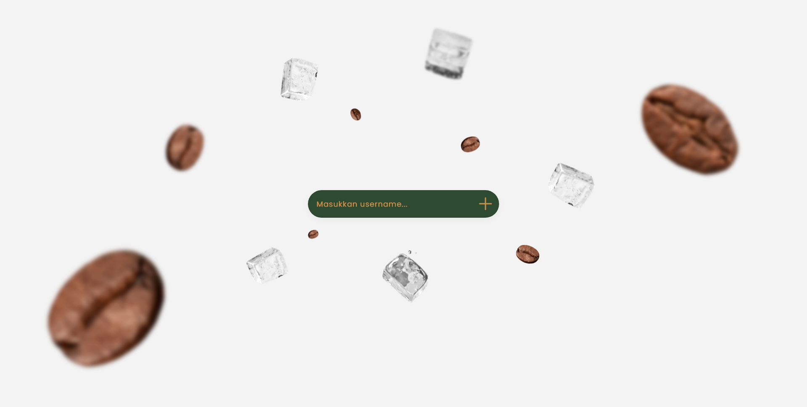</img>
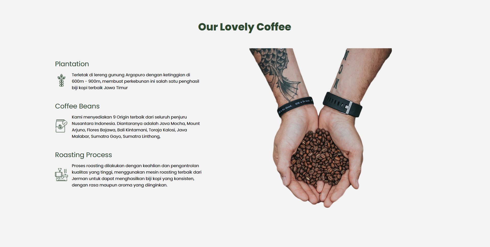</img>
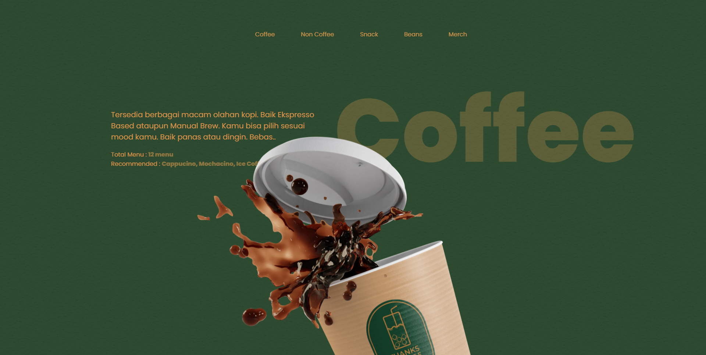</img>
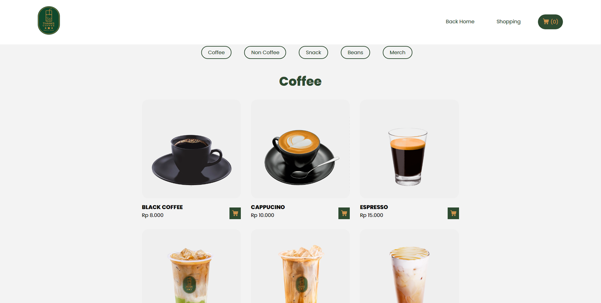</img>
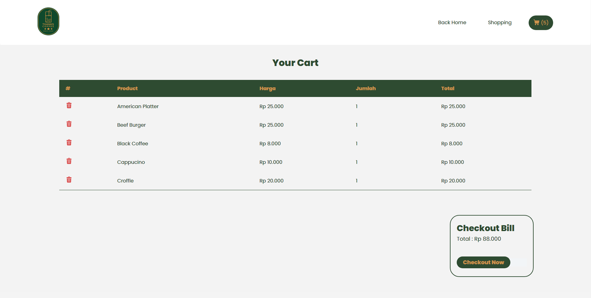</img>
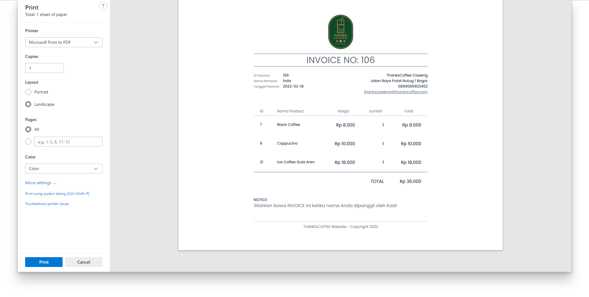</img>

## Made with ❤️ by 

|  |  | 
| :---------: | :---------: | 
|     [Yehezika Beatrix](https://github.com/yehezikabeatrix) |    [Adek Muhammad](https://github.com/adekmzrk)      |
