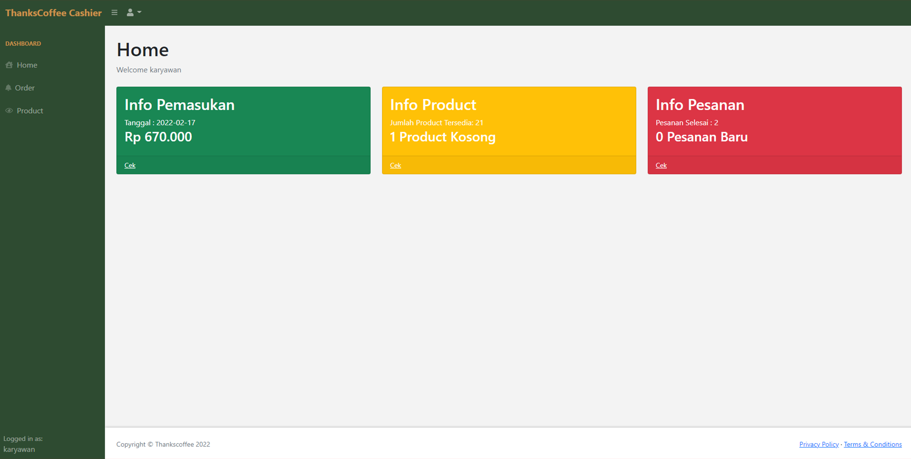

# ThanksCoffee - Website ☕️
:star: Star Us on Github - it helps!
<div align="center">

<p></p>
<a href="https://github.com/yehezikabeatrix/ThanksCoffee"></a>
<a href="https://github.com/yehezikabeatrix/ThanksCoffee"></a>
<a href="https://github.com/yehezikabeatrix/ThanksCoffee/commits/master"></a>  
<a href="https://www.instagram.com/yehezikabeatrix/"></a> 
<a href="https://www.instagram.com/adekmzrk/"></a> 
<a href="http://badges.mit-license.org"></a> 

</div>

<strong>ThanksCoffee Website</strong> adalah Sistem Kasir (Point of Sales), Manajemen Produk Toko, dan Halaman Pembelian Kopi berbasis website yang dibuat tanpa mengunakan framework tambahan dan dapat diakses tanpa menggunakan Internet. 
#### ⚡️ Kelebihan dari aplikasi ini adalah :
 - UI UX yang sangat dipikirkan
 - Dibangun menggunakan `HTML dan CSS`
 - Animasi menggunakan `CSS dan JS`
 - Database `MySQL`
 - Fitur `Pembersihan Database Otomatis`
 - Mudah untuk dimodifikasi
 - Dapat diakses tanpa menggunakan internet

#### ⚡️ Role yang terdapat di aplikasi ini adalah : 
 - Manajer  
 - Karyawan
 - Pelanggan

#### ⚡️ Manfaat yang didapatkan dari aplikasi ini :
 - Antara kasir dan pelanggan tidak perlu bertatap muka untuk memesan produk
 - Pelanggan dapat melihat-lihat produk dengan lebih leluasa, karena memiliki layar sendiri di mejanya
 - Meningkatkan level toko kopi *to the next level*
 - Mengurangi beban manajer untuk memonitoring toko kopi
 - Menambah keunikan toko kopi
 - Menarik pelanggan yang *instagrammable* dan haus modernisasi

## Requirements 🔧
Siapkan beberapa aplikasi berikut untuk menjalankan <strong>ThanksCoffee Website</strong> :
 - XAMPP (versi 3.3.0 atau versi terbaru).
 - PHP versi 5.6 atau terbaru
 - Teks Editor
 - Web Browser

## Instalasi 🔨
1. Clone atau download source code
    - Para terminal, clone repo `git clone git@github.com:yehezikabeatrix/ThanksCoffee.git`
    - atau `git clone https://github.com/yehezikabeatrix/ThanksCoffee.git`
    - Jika tidak menggunakan Git, silakan **Download Zip** dan *extract* pada direktori web server (misal: xampp/htdocs)
2. Buat **database baru pada mysql** untuk aplikasi ini dengan nama "thankscoffee"
3. Import database "thankscoffee" dengan file `thankscoffee.sql`
4. Pergi ke `db/koneksi.php' lalu edit host, username, dan password sesuai dengan milik kalin, defaultnya seperti ini:
    ```php
    $DATABASE_HOST = 'localhost';
    $DATABASE_USER = 'root';
    $DATABASE_PASS = '';
    ```
5. Selesai    

## Keamanan 🔐
Beberapa fitur keamanan yang diterapkan di aplikasi ini meliputi:
1. Validasi form input
2. Password handling

## Fitur Yang Dimiliki 🚀
Fitur akan dijelaskan berdasarkan Role yang dimiliki aplikasi ini. Berikut penjelasannya:

### Manajer 👨‍💼
<p align="center"></p>

**Manajer** adalah orang dengan jabatan tertinggi dibagian Toko Kopi. Role ini memiliki kelebihan untuk melihat data-data penting toko dan dapat melakukan perubahan juga padanya. Halaman manajer dapat diakses menggunakan URL `localhost:/ThanksCoffee/admin/index.php`

- **Credentials Manajer**
  ```
  Username: manajer
  Password: manajer
  ```  
- **Fitur Yang Dimiliki**
  - Akun Login
    - Login dan Logout
    - Ganti Password 
  - Dashboard
    - Info Pemasukan (Total pemasukan hari ini)
    - Info Product (Jumlah product tersedia dan product kosong)
    - Info Pesanan (Jumlah pesanan selesai dan pesanan baru masuk)
  - Manajemen Pesanan
    - Daftar pesanan masuk hari ini
    - Pembayaran pesanan
    - Penghapusan pesanan
    - Detail pesanan
  - Manajemen Produk
    - Daftar Produk
    - Input Produk Baru
    - Edit Produk (Jumlah stok)
    - Hapus Produk
  - Manajemen Laporan
    - Grafik penjualan produk hari ini
    - Grafik pemasukan perbulan
    - Penjualan Per Bulan
    - Penjualan Per Tanggal
  - Manajemen User
    - List User
    - Tambah User Baru
    - Hapus User (jika tidak ada transaksi)
  - Manajemen Toko
    - Edit Nama Cabang
    - Edit Alamat Cabang
    - Edit No telepon Cabang
    - Edit Email Cabang

### Karyawan 🤵
<p align="center"></p>

**Karyawan** adalah orang yang betugas sebagai kasir dari toko. Tugasnya berhubungan langsung dengan pelanggan dan melayani pesanan mereka. Halaman karyawan dapat diakses menggunakan URL `localhost:/ThanksCoffee/admin/index.php`

- **Credentials Karyawan**
  ```
  Username: karyawan
  Password: karyawan
  ```  
- **Fitur Yang Dimiliki**
  - Akun Login
    - Login dan Logout
    - Ganti Password 
  - Dashboard
    - Info Pemasukan (Total pemasukan hari ini)
    - Info Product (Jumlah product tersedia dan product kosong)
    - Info Pesanan (Jumlah pesanan selesai dan pesanan baru masuk)
  - Manajemen Pesanan
    - Daftar pesanan masuk hari ini
    - Pembayaran pesanan
    - Penghapusan pesanan
    - Detail pesanan
  - Manajemen Produk
    - Daftar Produk
    - Input Produk Baru
    - Edit Produk (Jumlah stok)
    - Hapus Produk

### Pelanggan 👨‍🎓
<p align="center"></p>

**Pelanggan** adalah orang yang membeli produk di toko. Setiap pelanggan mendapatkan laptop atau PC masing-masing untuk memesan pesanannya. Halaman pelanggan dapat diakses menggunakan URL `localhost:/ThanksCoffee/index.php`

#### Fitur Yang Dimiliki
1. Login
    - Login dengan username dan Logout
    - Username tidak boleh sama di hari yang sama
2. Halaman Utama
    - Section Promo
    - Section Why Choose US
    - Section Product
    - Section Testimoni
    - Section Feedback
3. Halaman Shopping
4. Halaman Check Out
5. Cetak Invoice Pesanan

## Made with ❤️ by 

|  |  | 
| :---------: | :---------: | 
|     [Yehezika Beatrix](https://github.com/yehezikabeatrix) |    [Adek Muhammad](https://github.com/adekmzrk)      |
